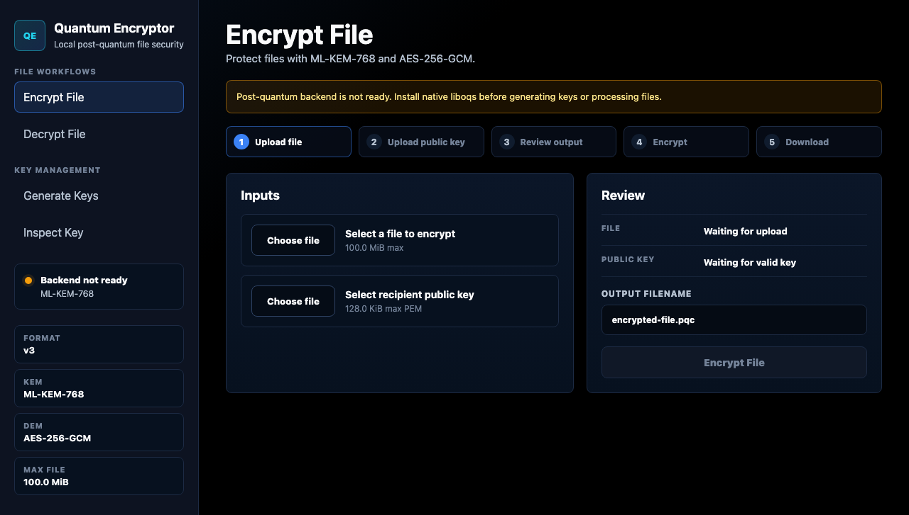
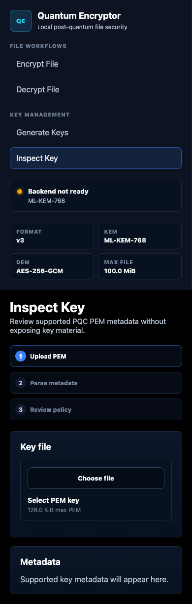

# Application Screenshots

These screenshots show the custom local web UI. They were captured from the local app with native `liboqs` unavailable, so the backend readiness warning and disabled key generation or file processing controls are expected.

## Custom Web Encrypt Workflow

## Custom Web Mobile Inspect

## Legacy Streamlit Reference

The default `./start.sh` path serves the custom local web UI. These older screenshots remain as a reference for the legacy Streamlit interface available through `LEGACY_STREAMLIT=1 ./start.sh`.

### Generate Keys

### Encrypt File

### Decrypt File

### Key Utilities

