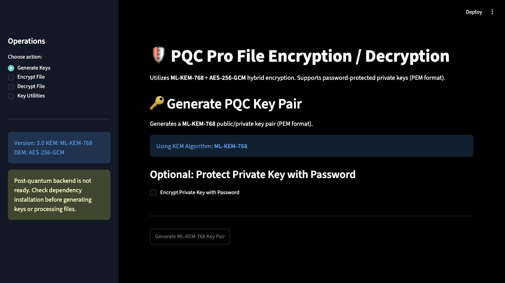
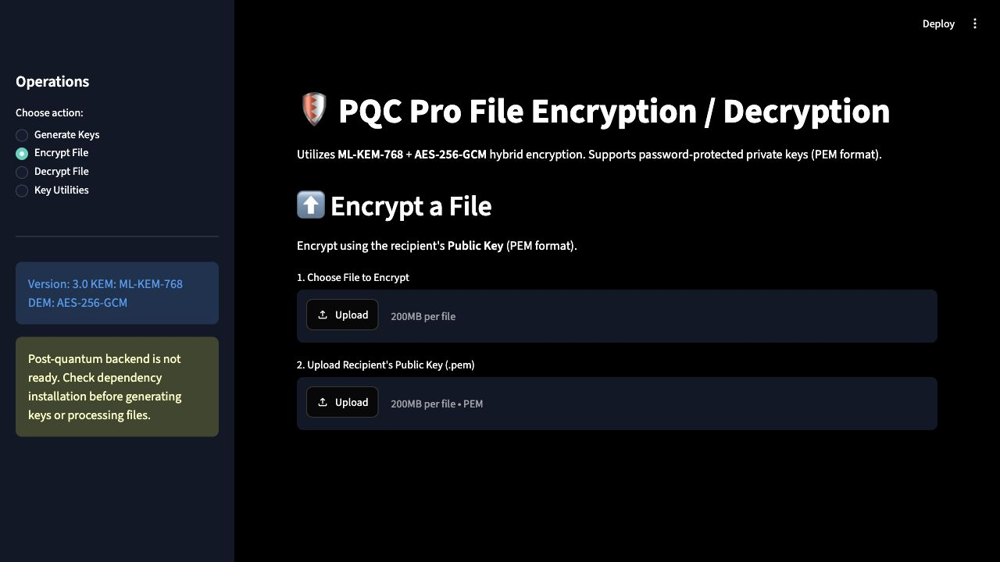
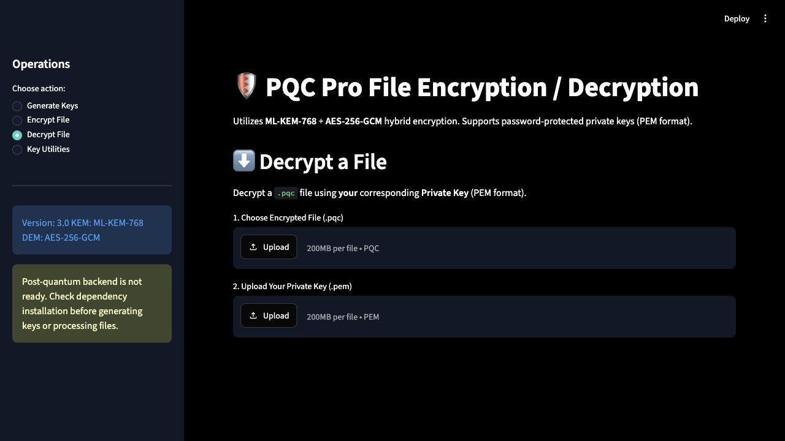
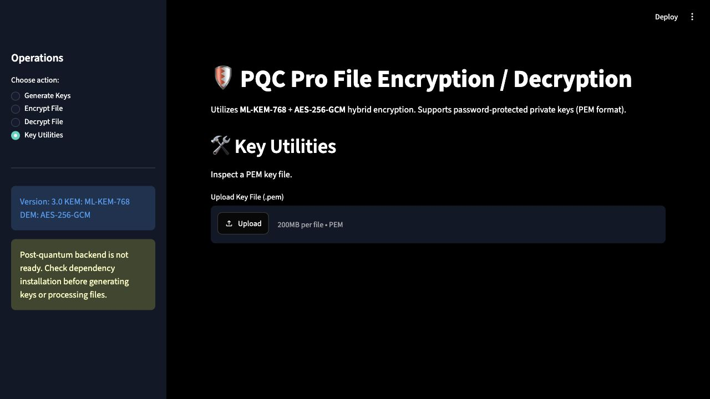

# Application Screenshots

These screenshots show the Streamlit interface using the tracked dark theme. They were captured from the local app with native `liboqs` unavailable, so the backend readiness warning and disabled key generation button are expected.

## Generate Keys

## Encrypt File

## Decrypt File

## Key Utilities

