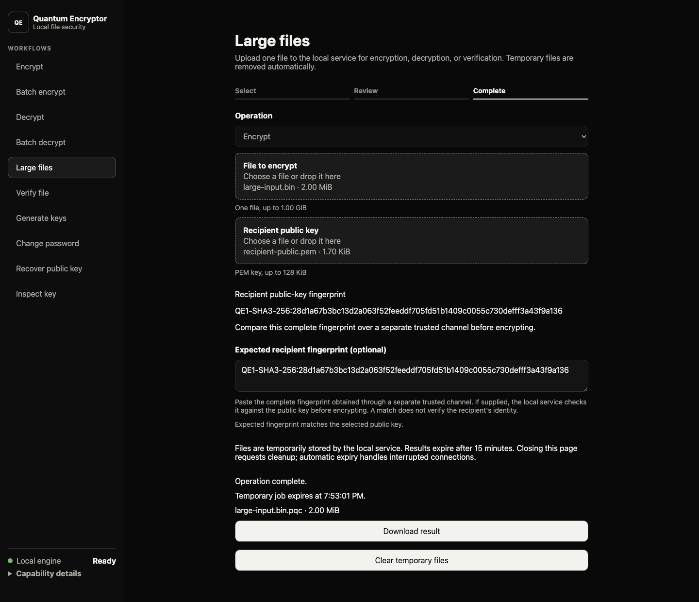

# Application Screenshots

These screenshots were captured from the real local web app with an available native cryptographic backend, sample files, and a freshly generated demonstration key pair. No API responses or successful operations are mocked. Public fingerprints shown here belong to disposable demonstration keys.

## Custom Web Encrypt Workflow

The demonstration expected fingerprint matches the selected public key. Both the interface and backend reject a mismatch before encryption. In real use, obtain the expected value through an independently authenticated channel. Equality identifies the same key; it does not certify the recipient's identity.


## Large-file Encryption Result

A real completed encryption job retains its result for an explicit download. The native browser check also decrypts it and compares the recovered bytes with the sample input.



## Custom Web Mobile Inspect


## Refreshing the Images

Build and start the app using the [README setup instructions](../README.md), with native encryption available. In a second terminal run:

```bash
npm run ui-native -- --screenshots
```

This runs the native workflow checks and overwrites these three images at desktop and mobile sizes. Captured pages also undergo automated accessibility and horizontal-overflow checks. Private keys and sample payloads live in an automatically cleaned temporary directory; no private PEM or password appears in the images. `UI_NATIVE_URL` selects another local app URL. If the installed Playwright browser is unavailable, `UI_BROWSER_EXECUTABLE` can select an existing compatible Chromium executable.
