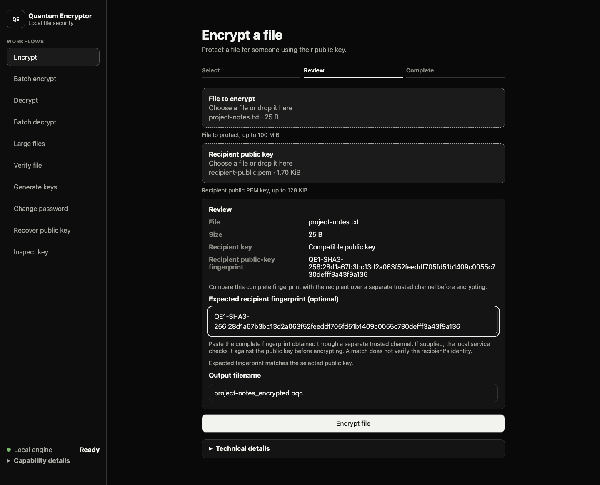
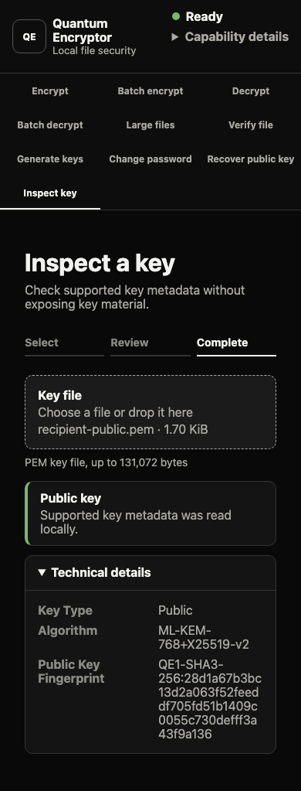

# Application Screenshots

These screenshots show the current monochrome custom local web UI. The interface uses progressive disclosure: plain-language task guidance appears first, while suite, format, and key-policy information stays inside **Technical details** until it is needed. The desktop Encrypt capture shows format version 4 and the `ML-KEM-768+X25519-v2` hybrid suite; the mobile Inspect key capture shows responsive workflow navigation and public-key metadata only.

## Custom Web Encrypt Workflow

## Custom Web Mobile Inspect

